<p align="center">
  
</p>

# Hogsend

[](https://github.com/dougwithseismic/hogsend/actions/workflows/ci.yml)

The lifecycle email automation that PostHog teams actually need. Code-first, self-hosted, open source.

PostHog tells you what users do. Resend delivers your emails. Hogsend is the bit in the middle — it listens for events, decides who gets what, waits, checks conditions, and sends. Journeys (email sequences) and buckets (real-time segments) are plain TypeScript functions, not YAML configs or drag-and-drop canvases — and because a user joining a bucket can itself trigger a journey, segmentation and messaging live in one event stream.

Built for small teams (1-10 eng) shipping product-led SaaS who picked PostHog and Resend and now need behavioral sequences without buying a third platform.

**[Documentation](https://docs.hogsend.com)** | **[Getting Started](https://docs.hogsend.com/docs/getting-started)** | **[CLI Reference](https://docs.hogsend.com/docs/cli)** | **[Compare](https://docs.hogsend.com/docs/compare)**

Everything ships on npm: scaffold an app with `pnpm dlx create-hogsend@latest`, self-host with Docker, or one-click on Railway.

> **A note from Doug** — I built Hogsend to do more for my clients, faster. I kept rebuilding the same PostHog + Resend lifecycle plumbing for every team, so I built it properly once and opened it up for everyone. If you'd like a hand getting it running — PostHog setup, journeys, templates, deploy — I can have you live in days. It's open source and yours to run solo; the offer to help is there if you want it.
>
> → **[About Hogsend & how to get in touch](https://docs.hogsend.com/docs/about)** — _Doug Silkstone_

---

## How It Works

Events flow in from PostHog, journeys react with emails via Resend, engagement data flows back. A closed loop — product analytics and lifecycle email in the same event stream.

<p align="center">
  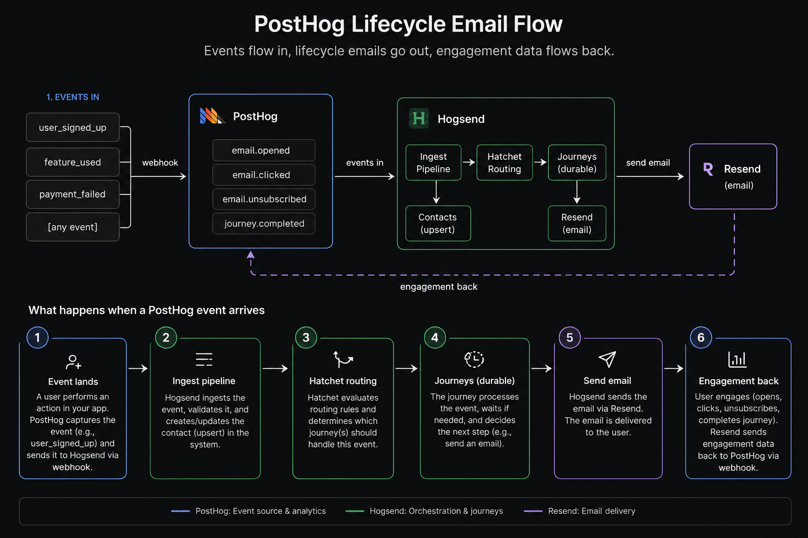
</p>

> Deep dive: **[How It Works](https://docs.hogsend.com/docs/concepts/how-it-works)** | **[Why PostHog?](https://docs.hogsend.com/docs/concepts/why-posthog)** | **[Why Hatchet?](https://docs.hogsend.com/docs/concepts/why-hatchet)** | **[Philosophy](https://docs.hogsend.com/docs/concepts/philosophy)**

---

## What You Can Build

- **Welcome sequences** that branch based on whether the user actually used the product
- **Trial-to-paid conversion** that watches for usage milestones and sends different emails depending on engagement
- **Payment failure recovery** — escalating reminders that stop the moment the payment goes through
- **Dormancy reactivation** — detect inactive users, run a win-back series, track if they come back
- **NPS / feedback collection** timed after key moments
- **Abandoned checkout recovery** — start a sequence when checkout begins, exit when it completes
- **Cross-journey orchestration** — one journey enrolls a user in another, chaining sequences without duplicating logic
- **Real-time segments** — group users the instant their behavior matches (power users, trials expiring, gone dormant), then trigger a journey off the membership change itself

Each is a single TypeScript file using `defineJourney()` — or `defineBucket()` for segments. The repo ships with [10 production-ready journeys](apps/api/src/journeys/) and [3 example buckets](apps/api/src/buckets/) covering common lifecycle stages.

## Buckets — real-time segments

Buckets are the peer of journeys: named, code-defined groups a user **joins** the moment their data matches and **leaves** when it stops. Each join and leave fires an event through the same pipeline, so **a membership change can trigger a journey** — bind one to `bucketEntered("went-dormant")` and it runs the instant someone goes dormant. You write a `defineBucket()` with criteria (the same condition engine, or a fluent builder) — no `run`, just the predicate. Membership recomputes in real time off your own event stream — the sub-hour, code-first complement to PostHog's ~24h batch cohorts — with a reconcile pass for time-based leaves and a `maxDwell` TTL.

```ts
import { days, defineBucket } from "@hogsend/engine";

export const wentDormant = defineBucket({
  meta: {
    id: "went-dormant",
    name: "Went dormant",
    enabled: true,
    timeBased: true,
    criteria: (b) =>
      b.all(
        b.event("app.active").exists(), // was active at some point
        b.event("app.active").within(days(7)).notExists(), // but not lately
      ),
  },
});
```

> Full guide: **[Buckets](https://docs.hogsend.com/docs/guides/buckets)**

---

## Example Emails

Hogsend dogfoods itself. The example templates in [`apps/api/src/emails/`](apps/api/src/emails/) are real lifecycle emails _about_ Hogsend — built with [React Email](https://react.email) + Tailwind, sent through journeys defined in code. They're yours to edit, rebrand, or delete. Here's the set as it ships:

<table>
  <tr>
    <td width="33%" valign="top"><b>Setup guide</b><br/><sub><code>activation-quickstart</code></sub><br/>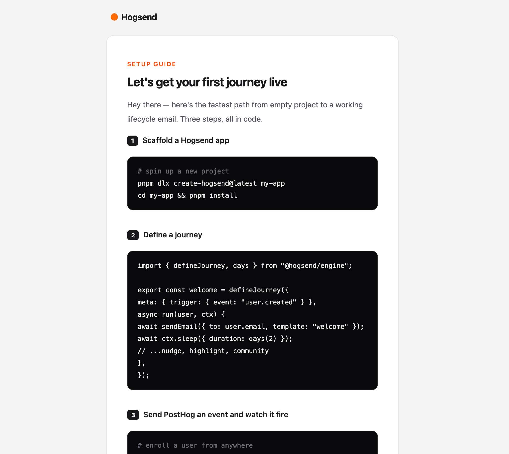</td>
    <td width="33%" valign="top"><b>No events yet</b><br/><sub><code>activation-nudge</code></sub><br/>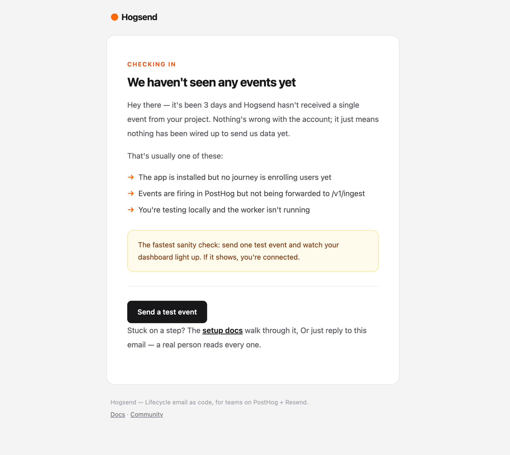</td>
    <td width="33%" valign="top"><b>Journeys as code</b><br/><sub><code>activation-feature-highlight</code></sub><br/>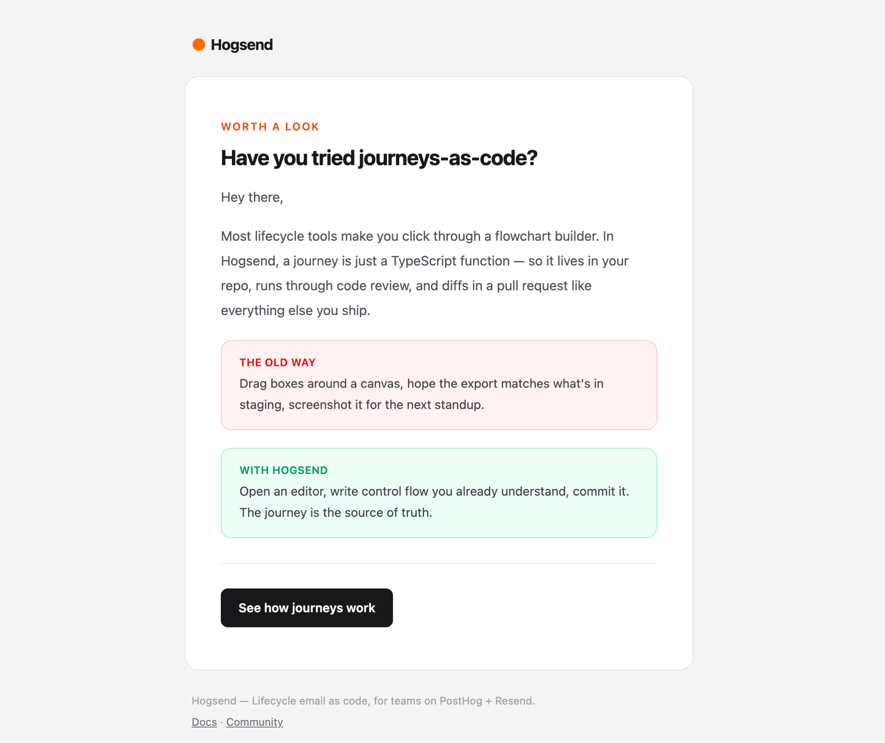</td>
  </tr>
  <tr>
    <td width="33%" valign="top"><b>What others build</b><br/><sub><code>activation-community</code></sub><br/>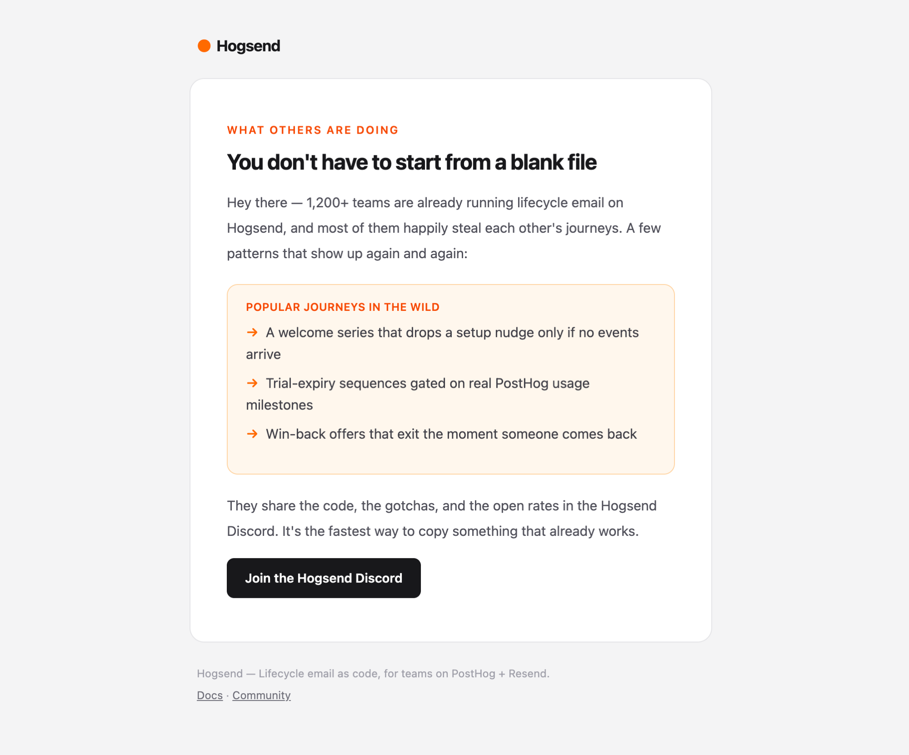</td>
    <td width="33%" valign="top"><b>Usage milestone</b><br/><sub><code>conversion-usage-milestone</code></sub><br/>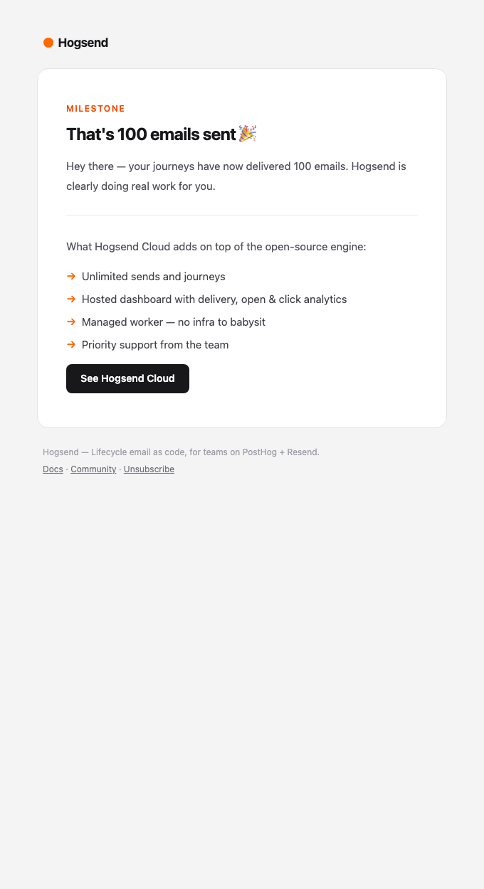</td>
    <td width="33%" valign="top"><b>Trial ending</b><br/><sub><code>conversion-trial-expiring</code></sub><br/>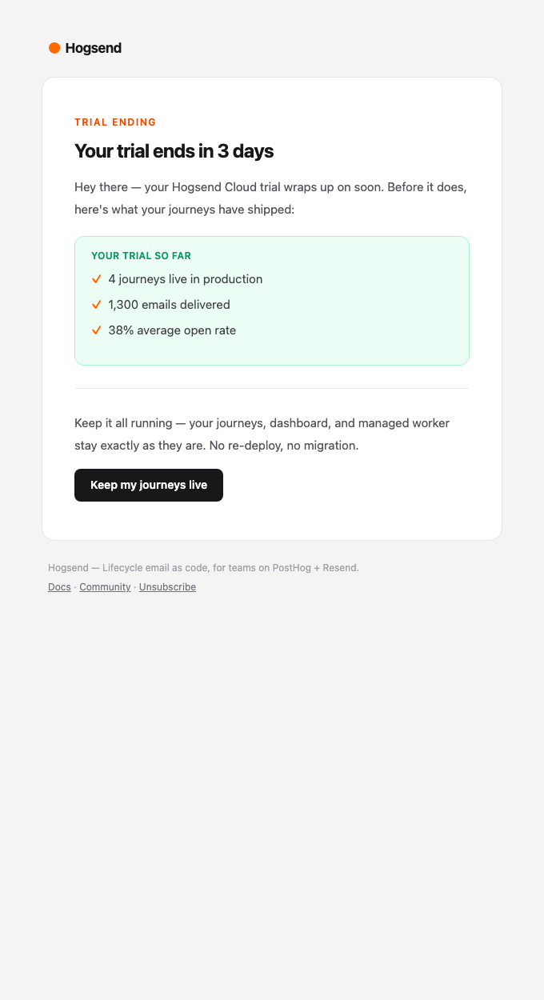</td>
  </tr>
  <tr>
    <td width="33%" valign="top"><b>Win-back offer</b><br/><sub><code>conversion-winback-offer</code></sub><br/>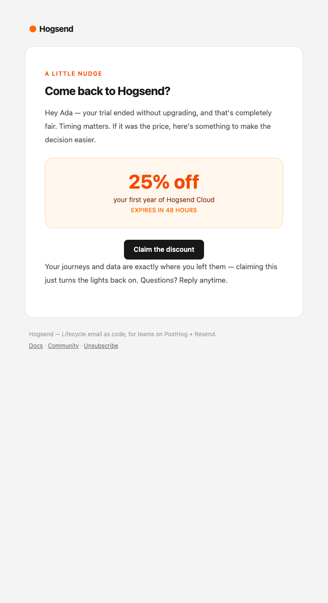</td>
    <td width="33%" valign="top"><b>Milestone unlocked</b><br/><sub><code>retention-achievement</code></sub><br/>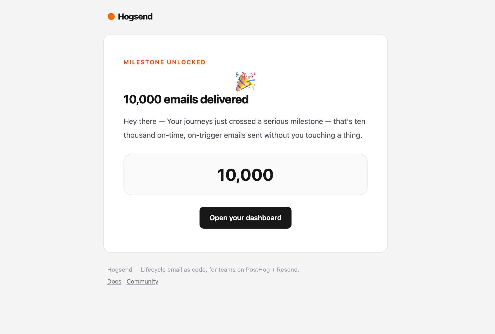</td>
    <td width="33%" valign="top"><b>Weekly digest</b><br/><sub><code>retention-weekly-digest</code></sub><br/>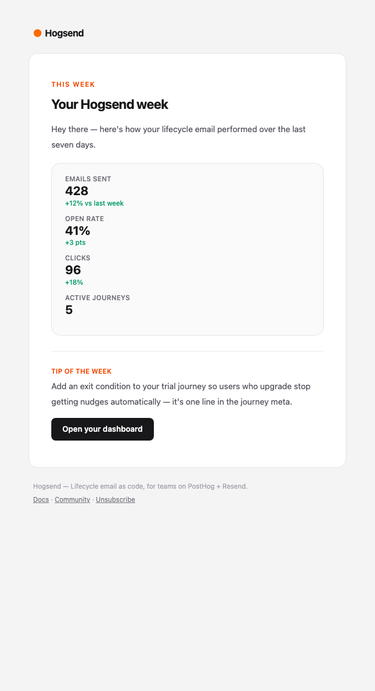</td>
  </tr>
  <tr>
    <td width="33%" valign="top"><b>Dormancy check-in</b><br/><sub><code>reactivation-checkin</code></sub><br/>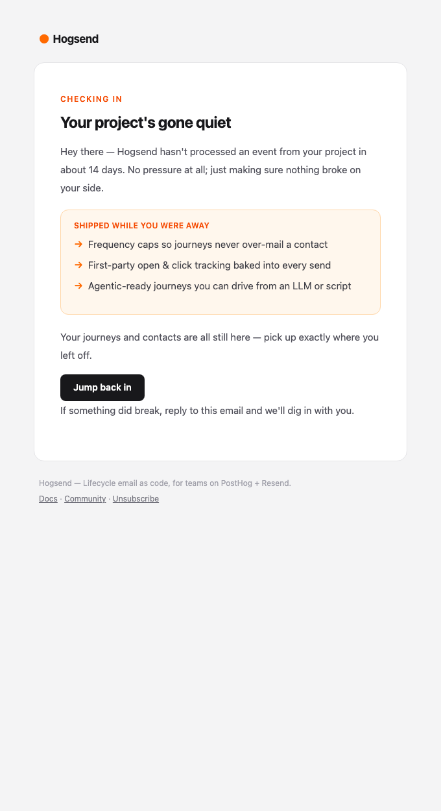</td>
    <td width="33%" valign="top"><b>Final nudge</b><br/><sub><code>reactivation-final-nudge</code></sub><br/>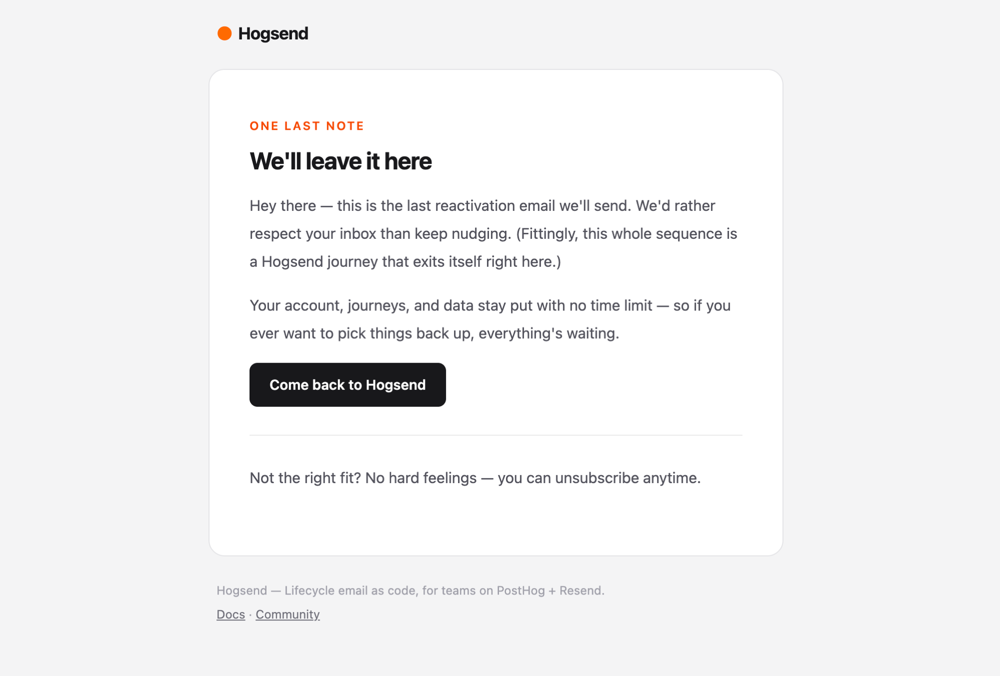</td>
    <td width="33%" valign="top"><b>NPS survey</b><br/><sub><code>feedback-nps-survey</code></sub><br/>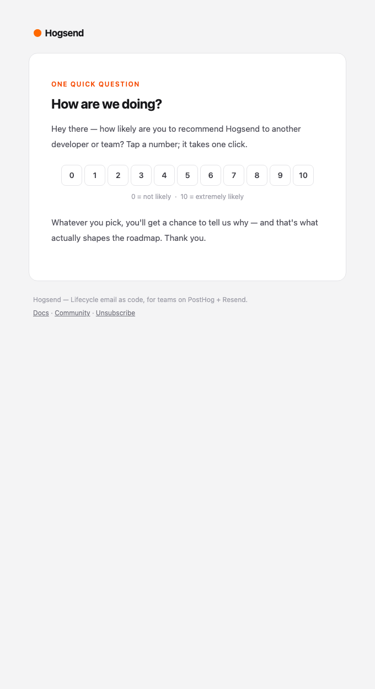</td>
  </tr>
  <tr>
    <td width="33%" valign="top"><b>Payment failed</b><br/><sub><code>churn-payment-failed</code></sub><br/>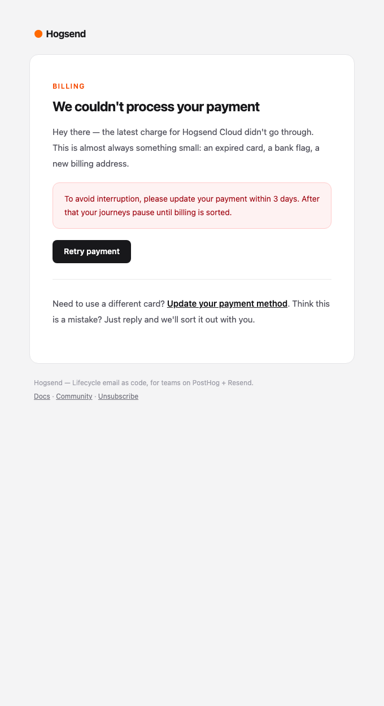</td>
    <td width="33%"></td>
    <td width="33%"></td>
  </tr>
</table>

---

## Quick Example

A `user_signed_up` event triggers this journey. It sends a welcome email, waits two days, checks if the user tried the core feature, and nudges them if not:

```typescript
import { days, defineJourney, sendEmail } from "@hogsend/engine";
import { Events, Templates } from "./constants/index.js";

export const activationWelcome = defineJourney({
  meta: {
    id: "activation-welcome",
    name: "Activation — Welcome Series",
    enabled: true,
    trigger: { event: Events.USER_CREATED },
    entryLimit: "once",
    exitOn: [{ event: Events.USER_DELETED }],
  },

  run: async (user, ctx) => {
    await sendEmail({
      to: user.email,
      userId: user.id,
      journeyName: user.journeyName,
      template: Templates.ACTIVATION_WELCOME,
      subject: "Welcome — let's get you set up",
    });

    await ctx.sleep({ duration: days(2), label: "post-welcome" });

    const { found } = await ctx.history.hasEvent({
      userId: user.id,
      event: Events.FEATURE_USED,
    });

    if (!found) {
      await sendEmail({
        to: user.email,
        userId: user.id,
        journeyName: user.journeyName,
        template: Templates.ACTIVATION_NUDGE,
        subject: "You haven't tried the key feature yet",
      });
    }
  },
});
```

That `ctx.sleep(days(2))` literally pauses for two days and picks up exactly where it left off — durable execution via [Hatchet](https://hatchet.run) that survives deploys and restarts. Need to wait on _behavior_ instead of the clock? `ctx.waitForEvent({ event: Events.FEATURE_USED, timeout: days(7) })` parks the journey until that user fires the event (or the timeout wins), then resumes — and an `exitOn` match cancels the wait mid-flight.

> Full guide: **[Journeys](https://docs.hogsend.com/docs/guides/journeys)** | **[Buckets](https://docs.hogsend.com/docs/guides/buckets)** | **[Events](https://docs.hogsend.com/docs/guides/events)** | **[Email](https://docs.hogsend.com/docs/guides/email)** | **[Conditions](https://docs.hogsend.com/docs/guides/conditions)**

---

## Get Started

Scaffold a fresh app with `create-hogsend`. It generates a thin app that pins `@hogsend/engine` and holds your content — journeys, email templates, webhook sources — then installs everything from npm:

```bash
pnpm dlx create-hogsend@latest my-app
cd my-app

cp .env.example .env        # set BETTER_AUTH_SECRET, RESEND_API_KEY, HATCHET_CLIENT_TOKEN
docker compose up -d        # Postgres, Redis, Hatchet-Lite
pnpm db:migrate             # engine track, then your client track
pnpm dev                    # API on http://localhost:3002
pnpm worker:dev             # Hatchet worker, in a second terminal
```

Fire a `user_signed_up` event and watch the journey run. Upgrade the framework with `pnpm up "@hogsend/*"` — never a fork or a merge.

> Full guide: **[Installation](https://docs.hogsend.com/docs/getting-started/installation)** | **[Configuration](https://docs.hogsend.com/docs/getting-started/configuration)** | **[PostHog Setup](https://docs.hogsend.com/docs/getting-started/posthog-setup)**

### The Hatchet token

Journeys are durable, which is what lets `ctx.sleep(days(2))` pause for two days and survive deploys. That durability is backed by [Hatchet](https://hatchet.run), so you need a `HATCHET_CLIENT_TOKEN`. The local `docker compose` runs `hatchet-lite` for you — mint a token from its dashboard at [`localhost:8888`](http://localhost:8888), or use [Hatchet Cloud](https://cloud.onhatchet.run) if you'd rather not run it yourself.

> Full guide: **[Hatchet setup](https://docs.hogsend.com/docs/getting-started/hatchet)**

### Deploy

Same app, deployed your way. One-click on Railway, or self-host the full stack anywhere that runs Node.js + Postgres:

[](https://railway.com/deploy/LxSCyR)

> Full guide: **[Deploy on Railway](https://docs.hogsend.com/docs/operating/deploy-railway)** | **[Deploy with Docker](https://docs.hogsend.com/docs/operating/deploy-docker)**

---

## CLI

`@hogsend/cli` is the agent-native companion — install it with `pnpm add -g @hogsend/cli`, or run any command through `pnpm dlx @hogsend/cli`. It talks to a running instance's admin API; pass `--json` for machine-readable output.

```bash
hogsend doctor      # Probe a running instance's health
hogsend journeys    # List, inspect, enable, and disable journeys
hogsend contacts    # List, inspect, and trace contact activity
hogsend stats       # System-wide overview metrics
hogsend events      # Stream a single user's event history
hogsend setup       # Local onboarding — docker compose up, gen secret, db:migrate
hogsend skills      # Install bundled Claude Code skills into .claude/skills
hogsend eject       # Vendor a @hogsend/* package into vendor/<name>
hogsend patch       # Patch a package via pnpm's native patch flow
```

> Full reference: **[CLI Reference](https://docs.hogsend.com/docs/cli)**

---

## Studio

Hogsend ships with **Studio** — a read-and-operate admin UI for your instance. It's built to **observe, not author**: journeys and templates stay code-first, while the Studio shows you what's happening and gives you a few targeted actions (resend a failed send, enable/disable a journey, un-suppress a contact, send a test, manage API keys). It's a static SPA over the same `/v1/admin/*` API the [CLI](#cli) drives, so everything you can see is also scriptable.

<table>
  <tr>
    <td width="50%" valign="top"><b>Sends</b><br/><sub>Every email — filter, sort, and drill into the delivery + engagement timeline</sub><br/>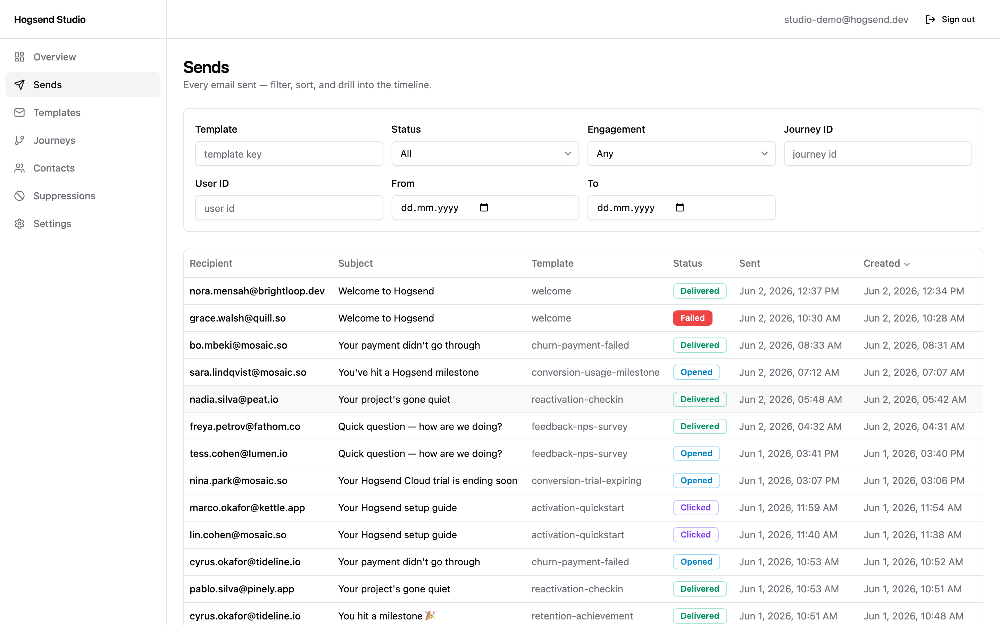</td>
    <td width="50%" valign="top"><b>Journeys</b><br/><sub>Enrollment and completion rates per journey, with an enable/disable toggle</sub><br/>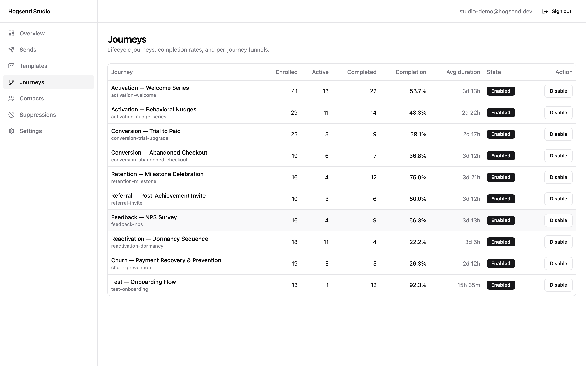</td>
  </tr>
  <tr>
    <td width="50%" valign="top"><b>Templates</b><br/><sub>The template catalog with a live preview, per-template stats, and send-test</sub><br/>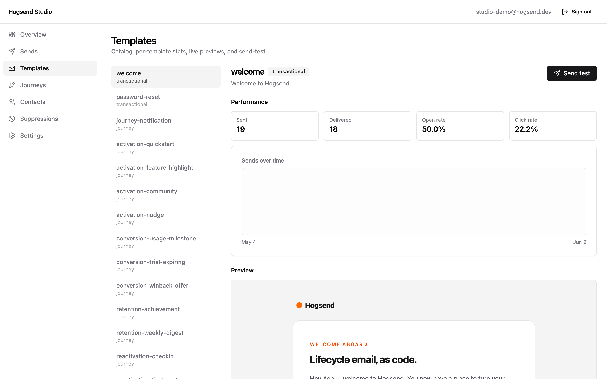</td>
    <td width="50%" valign="top"><b>Overview</b><br/><sub>Delivery and engagement metrics for the whole instance at a glance</sub><br/>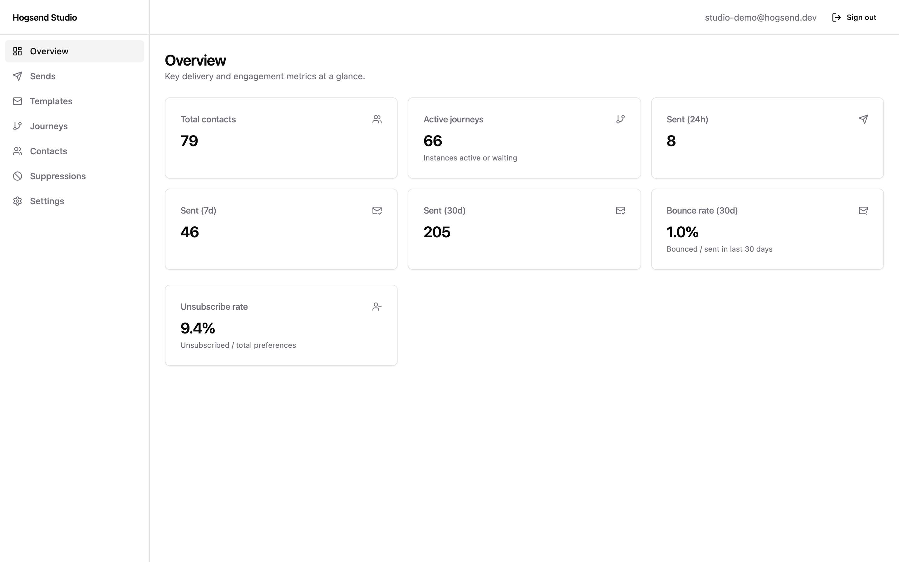</td>
  </tr>
</table>

The engine serves the built Studio at **`/studio`** on your API — same origin, so it uses your session cookie and needs no extra config (in the dogfood monorepo, build it once with `pnpm --filter @hogsend/studio build`). Or drive any instance from your machine with the CLI:

```bash
hogsend studio --open                                   # serve locally, open browser
hogsend studio --base-url https://api.example.com --open
```

> Full guide: **[Studio](https://docs.hogsend.com/docs/operating/studio)** | **[hogsend studio](https://docs.hogsend.com/docs/cli/studio)**

---

## Reporting

Every send is recorded — template, recipient, journey, and the full engagement trail (delivered, opened, clicked, bounced, complained) — and it's all queryable over the admin API. No external analytics, no ETL; the numbers are SQL aggregates computed on demand.

```bash
# What was sent to one user, oldest first
curl -H "Authorization: Bearer $ADMIN_API_KEY" \
  "$API/v1/admin/emails?userId=user_abc123&sort=createdAt&order=asc"

# Opened emails from a specific journey
curl -H "Authorization: Bearer $ADMIN_API_KEY" \
  "$API/v1/admin/emails?journeyId=activation-welcome&engagement=opened"

# One send's full delivery timeline (queued → sent → delivered → opened → clicked)
curl -H "Authorization: Bearer $ADMIN_API_KEY" "$API/v1/admin/emails/$ID"

# Per-template performance over a window
curl -H "Authorization: Bearer $ADMIN_API_KEY" \
  "$API/v1/admin/metrics/emails?from=2026-05-01T00:00:00Z"
```

- **`GET /v1/admin/emails`** — filter by `templateKey`, `category`, `status`, `journeyId`, `userId`, `engagement` (opened/clicked/bounced/complained), and a date window; sort by any lifecycle timestamp. Each row resolves who it went to and from which journey.
- **`GET /v1/admin/emails/{id}`** — a single send with a chronological `events[]` timeline and every tracked-link click (URL, IP, user agent).
- **`GET /v1/admin/metrics/emails`** — per-template `sent`/`delivered`/`opened`/`clicked`/`bounced` with delivery, open, click, and click-to-delivery rates over an optional window.

> Full guide: **[Email Operations](https://docs.hogsend.com/docs/operating/emails)** | **[Metrics & Analytics](https://docs.hogsend.com/docs/operating/metrics)** | **[API Reference](https://docs.hogsend.com/docs/api/emails)**

---

## Stack

| Concern | Tool |
|---------|------|
| HTTP API | Hono on Node.js |
| Durable execution | Hatchet (sleeps, retries, event routing) |
| Database | TimescaleDB (Postgres 18) via Drizzle ORM |
| Cache | Redis |
| Email delivery | Resend (`@hogsend/plugin-resend`) |
| Product analytics | PostHog (`@hogsend/plugin-posthog`) |
| Email templates | React Email |
| CLI | TypeScript on Node (`@hogsend/cli`) |
| Deploy | Railway (one-click), Docker Compose, or bring-your-own |

Plugins are standalone packages — create your own for Slack, Twilio, or any service. See **[Creating Plugins](https://docs.hogsend.com/docs/guides/plugins)**.

---

## Explore the Docs

| Section | What's there |
|---------|-------------|
| **[Getting Started](https://docs.hogsend.com/docs/getting-started)** | Installation, PostHog setup, configuration reference |
| **[Concepts](https://docs.hogsend.com/docs/concepts/how-it-works)** | How it works, why PostHog, why Hatchet, philosophy |
| **[Compare](https://docs.hogsend.com/docs/compare)** | Hogsend vs Customer.io, Loops, Brevo, ActiveCampaign — feature matrix and migration |
| **[Building](https://docs.hogsend.com/docs/guides/journeys)** | Journeys, buckets, events, email, conditions, creating plugins |
| **[CLI Reference](https://docs.hogsend.com/docs/cli)** | Every command documented with examples |
| **[Operating](https://docs.hogsend.com/docs/operating)** | Deployment, auth, monitoring, metrics, bulk ops, troubleshooting |
| **[API Reference](https://docs.hogsend.com/docs/api)** | Every endpoint with request/response examples |

---

## Contributing

See [CONTRIBUTING.md](CONTRIBUTING.md) for setup, code style, and how to submit changes.

## License

[Elastic License 2.0 (ELv2)](LICENSE) — use, modify, and self-host freely. You can't offer it as a managed service or remove license key functionality. See [LICENSE](LICENSE) for full terms.
